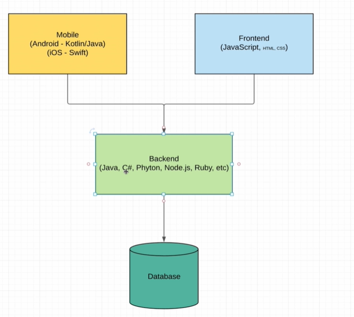
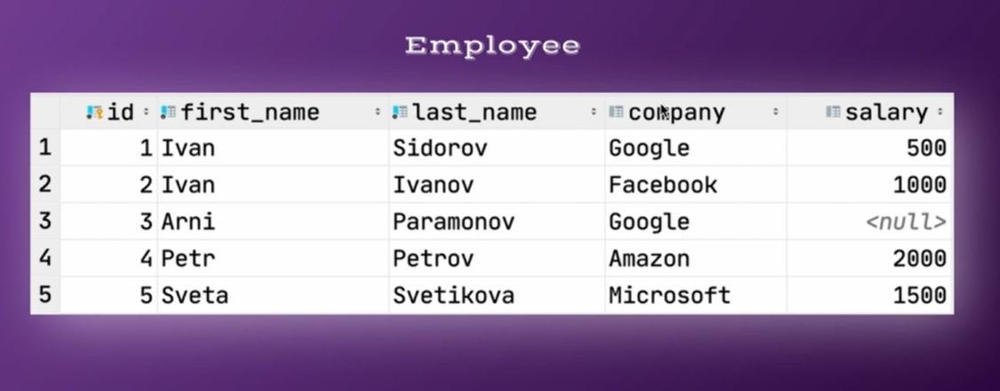
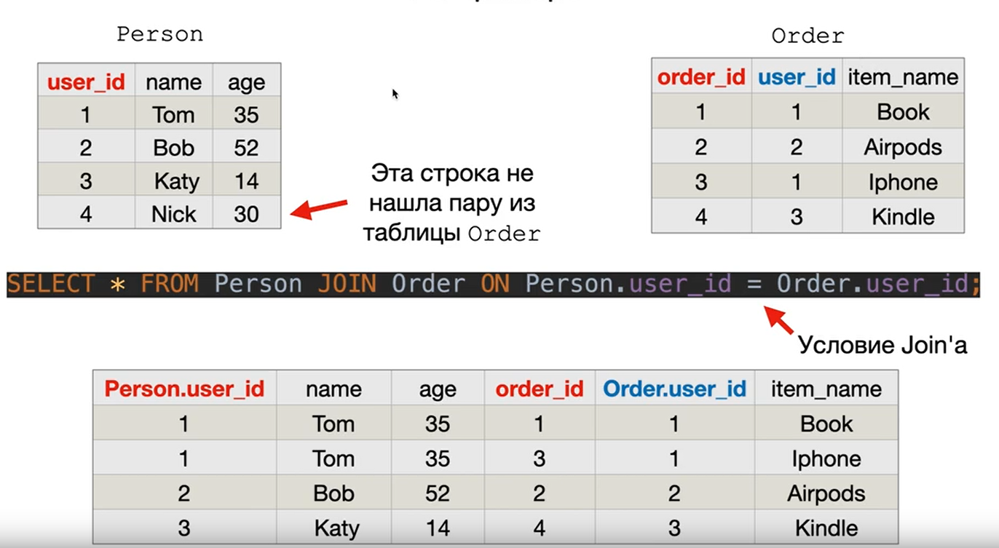

# SQL



## Базы данных

**• Предназначены для долговременного хранения информации.** <br/>
**• Позволяют быстро находить нужные данные, так как обладают встроенными средствами поиска.** <br/>
**• Реляционные базы используют табличную структуру для хранения данных, а для работы с ними используют язык SQL.**

## СУБД

*СУБД - это всего лишь приложение, способное манипулировать данными.*


**• Система управления базами данных. Например: MySQL, PostgreSQL, Oracle, MsSQL.** <br/>
**• «Надстройка» над базами данных, организующая работу с БД и добавляющая дополнительную функциональность.** <br/>
**• Каждая СУБД обладает своими отличиями. Например, встроенными типами данных.** <br/>
**• Каждая СУБД снабжена своим процедурным языком программирования.**

## DDL & DML


## Создание таблиц

*Пример создания базы данных, схемы и таблицы:*

```postgresql
CREATE DATABASE company_repository;

CREATE SCHEMA company_storage;

CREATE TABLE company
(
    id   INT,
    name VARCHAR(128),
    date DATE
);
```

## Операция INSERT

*Операция INSERT позволяет производить вставку данных в таблицу.*

```postgresql
CREATE TABLE company
(
    id   INT,
    name VARCHAR(128),
    date DATE
);

INSERT INTO company (id, name, date)
VALUES (1, 'Google', '2001-01-01'),
       (2, 'Apple', '2002-10-29'),
       (3, 'Facebook', '1998-09-13');
```

## Constraints в PostgreSQL

**Ограничения позволяют избежать ошибок**

Например, если мы храним обычную цену и цену со скидкой, то мы можем гарантировать, что цена со скидкой будет всегда
меньше обычной:

```postgresql
CREATE TABLE products
(
    product_no       integer,
    name             text,
    price            numeric CHECK (price > 0),
    discounted_price numeric CHECK (discounted_price > 0),
    CHECK (price > discounted_price)
);
```

*Из примера выше видно, что ограничение-проверка может ссылаться на несколько столбцов.*

### Ключевое слово CONSTRAINT

*Это ключевое слово используется для создания именованного ограничения:*

```postgresql
CREATE TABLE products
(
    product_no integer,
    name       text,
    price      numeric
        CONSTRAINT positive_price CHECK (price > 0)
);
```

```postgresql
CREATE TABLE company
(
    id   INT PRIMARY KEY,
    name VARCHAR(128) UNIQUE NOT NULL,
    date DATE CHECK ( date > '2000-01-01' AND date < '2023-05-07' )
);
```

### NOT NULL

*Ограничение NOT NULL в PostgreSQL гарантирует, что столбец не может содержать никаких нулевых значений.*


### UNIQUE

*Ограничения уникальности гарантируют, что данные в определённом столбце или группе столбцов уникальны среди всех строк
таблицы.*


При добавлении ограничения уникальности будет автоматически создан уникальный индекс B-дерева для столбца или группы
столбцов, перечисленных в ограничении.

### CHECK

*Ограничение-проверка - наиболее общий тип ограничений. В его определении вы можете указать, что значение данного
столбца должно удовлетворять логическому выражению (проверке истинности).*


### PRIMARY KEY

*Ограничение первичного ключа означает, что образующий его столбец или группа столбцов может быть уникальным
идентификатором строк в таблице*

**Для этого требуется, чтобы значения были одновременно уникальными и отличными от NULL.**

```postgresql
CREATE TABLE products
(
    product_no INT UNIQUE NOT NULL,
    name       TEXT,
    price      NUMERIC
);
CREATE TABLE products
(
    product_no INT PRIMARY KEY,
    name       TEXT,
    price      NUMERIC
);
```

При добавлении первичного ключа автоматически создаётся уникальный индекс B-дерева для столбца или группы столбцов,
перечисленных в первичном ключе, и данные столбца помечаются как NOT NULL.

## Sequence in PostgreSQL

*В PostgreSQL последовательность - это особый тип объекта базы данный, который генерирует последовательность целых
чисел.*

```postgresql
CREATE TABLE company
(
    id SERIAL
);
```

## Операция SELECT

*Операция SELECT позволяет получить строки из таблицы или представления.*

Пример вывода всех полей таблицы:

```postgresql
SELECT *
FROM company;
```

## Alias в PostgreSQL

Псевдонимы таблиц временно назначают таблицам новые имена во время выполнения запроса.

Пример использования псевдонима:

```postgresql
SELECT id,
       name AS alias_name,
       date
FROM company AS com;
```

## Ключевое слово DISTINCT

*Ключевое слово DISTINCT используется в операции SELECT для удаления повторяющихся строк из набора результатов.
Предложение
DISTINCT сохраняет одну строку для каждой группы дубликатов. Ключевое слово DISTINCT может быть применимо к одному или
нескольким
столбцам в списке выборки операции SELECT.*

Пример использования DISTINCT:


## Ключевое слово WHERE

*Оператор SELECT возвращает все строки из одного или нескольких столбцов таблицы. Чтобы выбрать строки, удовлетворяющие
заданному условию, следует использовать WHERE.*

Пример использования *WHERE*:

```postgresql
SELECT *
FROM employee
WHERE salary > 1500;
```

## Ключевое слово LIKE, ILIKE и BETWEEN

*Выражение LIKE возвращает true, если строка соответствует заданному шаблону.*

'Ivanov' LIKE '%ov%' - *true* <br/>
'Ivanov' LIKE '%ov_' - *false* <br/>
'Svetikova' LIKE '%ov_' - *true* <br/>

*Ключевое слово ILIKE используется для того, чтобы поиск был регистр-независимым*

*Условие BETWEEN используется для получения значений в диапазоне:*

```postgresql
SELECT *
FROM employee
WHERE salary BETWEEN 1200 AND 2100;
```

*Для нахождения конкретного значения, используется ключевое слово **IN***.

```postgresql
SELECT *
FROM employee
WHERE salary IN (500, 1000);
```

## Foreign key

*Внешний ключ - это столбец или группа столбцов, которые ссылаются на первичный ключ другой таблицы .*

Пример использования внешнего ключа на другую таблицу:

```postgresql
CREATE TABLE company
(
    id   SERIAL PRIMARY KEY,
    name VARCHAR(128) UNIQUE NOT NULL,
    date DATE CHECK ( date > '2000-01-01' AND date < '2023-05-07' )
);

CREATE TABLE employee
(
    id         SERIAL PRIMARY KEY,
    first_name VARCHAR(128) NOT NULL,
    last_name  VARCHAR(128) NOT NULL,
    company_id INT REFERENCES company (id),
    salary     INT,
    UNIQUE (first_name, last_name)
);
```

*Внешний ключ позволяет обезопасить работу с таблицами.*


## Агрегатные и встроенные функции

### 5 функций, которые представлены во всех СУБД: *sum, avg, max, min, count*.

*1) Функция **sum()** используется для суммирования значений столбцов:*

```postgresql
SELECT sum(salary)
FROM employee;
```


*2) Также присутствуют функции avg() - для нахождения среднего значения, max() - для нахождения максимального значения,
min() - для нахождения минимального.*

*3) Функция **count()** позволяет получить количество полей в таблице.*

• count(*) - ищет все записи, которые вернулись. <br/>
• count(salary) - ищет записи по определённому столбу. Если по определённому столбцу вернулся *null*, то значение не
учитывается.

*4) Функция **upper()** - применяется для возведения данных поля в верхний регистр, **lower()** - в нижний.*

```postgresql
SELECT upper(first_name) AS upperName,
       lower(last_name)  AS lowerSurname
FROM employee;
```


*5) Функция **concat()** используется для конкатенации строк.*

```postgresql
SELECT concat(first_name, ' ', last_name) AS concat
FROM employee
```


### Примечание:

*Всегда, когда мы хотим проверить поле на **NULL**, нам необходимо использовать ключевое слово IS:*

```postgresql
SELECT first_name
FROM employee
WHERE company_id IS NULL;
```

## Объединение множеств. UNION

*Оператор UNION используется для объединения результирующих наборов из 2 и более операторов
SELECT. **Он удаляет повторяющиеся строки между различными операторами SELECT.***

*Каждый оператор SELECT в операторе UNION должен иметь одинаковое количество полей в наборах результатов с одинаковыми
типами данных.*

Пример использования UNION:

*Первое множество:*

```postgresql
SELECT first_name
FROM employee
WHERE company_id IS NOT NULL
```


*Второе множество:*

```postgresql
SELECT first_name
FROM employee
WHERE salary IS NULL
```


**Результат объединения UNION:**

```postgresql
SELECT first_name
FROM employee
WHERE company_id IS NOT NULL
UNION
SELECT first_name
FROM employee
WHERE salary IS NULL
```


## Объединение множеств. UNION ALL

*Оператор UNION ALL используется для объединения результирующих наборов из 2 и более операторов SELECT. Он возвращает
все строки из запроса и не удаляет повторяющиеся строки между различными операторами SELECT.*

*Каждый оператор SELECT в операторе UNION ALL должен иметь одинаковое количество полей в наборах результатов с
одинаковыми типами данных.*

```postgresql
SELECT first_name
FROM employee
WHERE company_id IS NOT NULL
UNION ALL
SELECT first_name
FROM employee
WHERE salary IS NULL
```

**Результат объединения UNION ALL:**


## Подзапросы

*Подзапросы (subquery) представляют собой такие запросы, которые могут быть встроены в другие запросы.*

Примеры:

```postgresql
SELECT avg(empl.salary)
FROM (SELECT *
      FROM employee
      ORDER BY salary
      LIMIT 2) empl;
```

```postgresql
SELECT *,
       (SELECT avg(salary) FROM employee) - salary diff
FROM employee;
```

```postgresql
SELECT *
FROM employee
WHERE company_id IN (SELECT company.id FROM company WHERE date < '2005-02-02')
```

## Команда DELETE

*Команда DELETE удаляет из указанной таблицы строки.*

Пример использования команды DELETE:

```postgresql
DELETE
FROM employee
WHERE salary IN (SELECT min(salary) FROM employee);
```

При попытке удаления таблица, на которую ссылаются другие таблицы, мы получим ошибку


Для обхода ошибки необходимо удалить таблицу, которая ссылается на исходную.


### Ограничение проверки ON DELETE

• **ON DELETE CASCADE** - во время удаления одной из таблиц, связанная таблица удаляется. <br/>
• **SET DEFAULT** - указание значения по умолчания в случае удаления. <br/>
• **SET NULL** - установление значения NULL в случае удаления.

## Команда UPDATE

*Команда UPDATE изменяет значения указанных столбцов во всех строках, удовлетворяющих условию. В предложении SET должны
указываться только те столбцы, которые будут изменены.*

Пример использования команды UPDATE:

```postgresql
UPDATE employee
SET id     = 3,
    salary = 1000
WHERE id = 10;
```

В случае отсутствия ключевого слова WHERE, изменения применяются ко всем полям таблицы.

*Предложение RETURNING указывает, что команда UPDATE должна вычислить и возвратить значения для каждой фактически
изменённой строки.*

Пример использования предложения RETURNING:


# Нормализация баз данных

**Реляционная база данных - это упорядоченная информация, связанная между собой определёнными отношениями.**


**Нормализация** - метод проектирования базы данных, который позволяет привести базу данных к минимальной избыточности.

**Избыточность данных** - это когда одни и те же данные хранятся в базе в нескольких местах (таблицах), именно это и
приводит к различным аномалиям.

*Пример аномалии:*



*Проблема:* Отсутствие ограничение на столбец *company*. Добавляя нового сотрудника, мы можем ошибиться во вводе
компании.


*Решение проблемы:* Создание отдельной таблицы.


**Нормальная форма базы данных** - это набор правил и критериев, которым должна отвечать база данных.

## Перечень нормальных форм:


*На практике обычно используется Первая - Третья нормальные формы.*

## Требования первой нормальной формы (1НФ)

Чтобы база данных находилась в первой нормальной форме (1НФ), необходимо чтобы её таблицы соблюдали следующие
реляционные принципы:

1. В таблице не должно быть дублирующих строк.
2. В каждой ячейке таблицы хранится атомарное значение.
3. В столбце хранятся данные одного типа.

Пример несоблюдения требований первой нормальной формы:


*Решение:*


## Требования второй нормальной формы (2НФ)

Чтобы база данных находилась во второй нормальной форме (2НФ), необходимо чтобы её таблицы удовлетворяли следующих
требованиям:

1. Таблица должна находиться в первой нормальной форме.
2. Таблица должна иметь первичный ключ *(PRIMARY KEY)*.
3. Все неключевые столбцы таблица должны зависеть от полного первичного ключа (в случае если он составной).

*Решение:*


*Как делать нельзя:*


*Неключевым столбцам достаточно ссылаться на id.*

## Требования третьей нормальной формы (3НФ)

Чтобы база данных находилась в третьей нормальной форме (3НФ), необходимо чтобы её таблицы удовлетворяли следующим
требованиям:

1. Таблица должна находиться во второй нормальной форме.
2. В таблице должна отсутствовать транзитивная зависимость неключевых столбцов.


***contact_type** никак не относится к employee, а относится к contact.*

*Решение - декомпозиция*

**Декомпозиция - это процесс разбиения одной таблицы на несколько.**


### Итог:

**1НФ** - наше внимание нацелено на соблюдение простейших реляционных принципов (нет дублирования и атомарные значения в
ячейках).

**2НФ** - наше внимание нацелено на первичный ключ.

**3НФ** - наше внимание нацелено на неключевые столбцы.

## Связи между таблицами в реляционных базах данных

*Для связывания таблиц обычно используется первичный ключ **PRIMARY KEY** (реже уникальное поле **UNIQUE**) одной
таблицы и внешний ключ **FOREIGN KEY** второй таблицы.*

**Выделяют 3 вида связей между таблицами в реляционных базах данных.**

1. Один ко многим
2. Один к одному
3. Многие ко многим

### Один ко многим


Мы как бы ссылаемся из Contact на Employee. Делается это потому, что у одного сотрудника может быть несколько контактов.

То есть один employee относится к множеству контактов.

**PRIMARY KEY содержит только уникальные значения, FOREIGN KEY может содержать дубликаты.**

**Таблица, содержащая FOREIGN KEY - дочерняя. Таблица, содержащая только PRIMARY KEY - родительская.**

**Один заказ не может принадлежать нескольким людям, так как на *order_id* ограничение PRIMARY KEY.**

*Пример:* Покупатель и заказы, учитель и ученики, библиотека и книги, режиссёр и его фильмы.

****

### Один к одному


Одна строчка таблицы Contact может ссылаться только на одного сотрудника из таблицы Employee, либо не ссылаться на него
вовсе.

*Другой вариант:*


*Другой вариант:*


**В таблице Passport *FK=PK*.**

**Человек может существовать без паспорта (Parent), но паспорт не может существовать без человека (Child).**

**Колонка *person_id* имеет ограничение PRIMARY KEY, поэтому у человека может быть только один паспорт.**

*Пример:* президент и страна, директор и школа.

****

### Многие ко многим


*Пример:* учёные и научные статьи, студенты и занятия.

****

# Связывание таблиц (Database joins)

• Наши нормализованные таблицы эффективно хранят данные, но нам тяжело воспринимать данные

• Мы хотим **временно** слить таблицы в одну (не создавая новых таблиц), чтобы удобно посмотреть все данные и
взаимоотношения.


*Таблица не создаётся в БД (видная нам только для чтения)*

*Вариант получения данных без использования JOIN:*

```postgresql
SELECT Person.name name,
       Order.item_name
FROM Person,
     Order
WHERE Person.user_id = Order.order_id;
```

**Виды JOIN'ов:**

• INNER JOIN <br/>
• CROSS JOIN <br/>
• LEFT OUTER JOIN <br/>
• RIGHT OUTER JOIN <br/>
• FULL OUTER JOIN <br/>

### JOIN

*INNER JOIN представляет из себя внутреннее соединение.*

```postgresql
SELECT P.name name,
       O.item_name
FROM Person P
         JOIN Order_ O on P.user_id = O.user_id
```



### CROSS JOIN

*CROSS JOIN представляет из себя перекрёстное соединение набора строк, где каждая строка из одной таблицы соединяется с каждой строкой из второй таблицы.*

```postgresql
SELECT *
FROM Person AS P
         CROSS JOIN
     Order_ AS O;
```